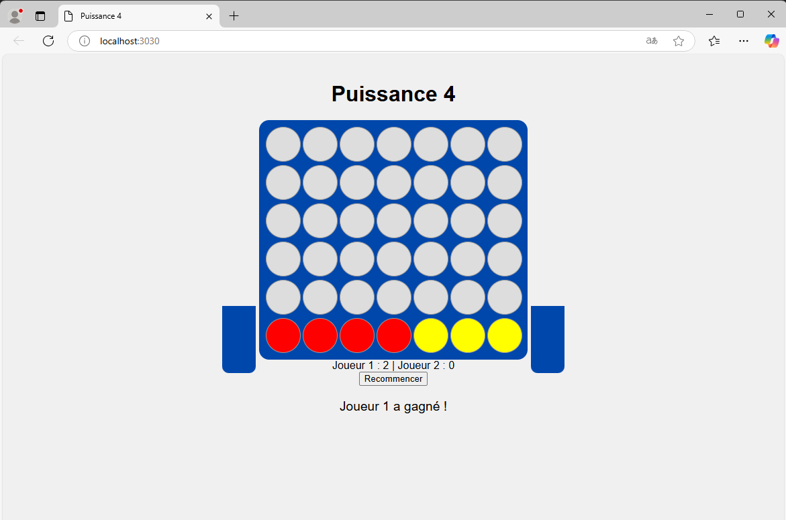

# Puissance 4

Ce projet est une implémentation du célèbre jeu **Puissance 4** utilisant **PHP**, **JavaScript** et **CSS**.  
Il vous permet de jouer à deux joueurs directement dans votre navigateur.

---

## 🚀 Comment démarrer le projet ?

### Pré-requis
- PHP installé sur votre machine.
- Un navigateur web.

### Commande pour lancer le serveur local :
Dans le terminal, exécutez la commande suivante à la racine du projet :
```sh
php -S localhost:3030 -t .
```
### 📂 Structure du projet
- index.php : Le point d'entrée principal, contient la structure HTML.
- style.css : Fichier de styles pour la grille et les pions.
- game.js : Contient toute la logique de jeu en JavaScript.

### 💻 Captures d'écran
Voici une capture d'écran du jeu en action :

